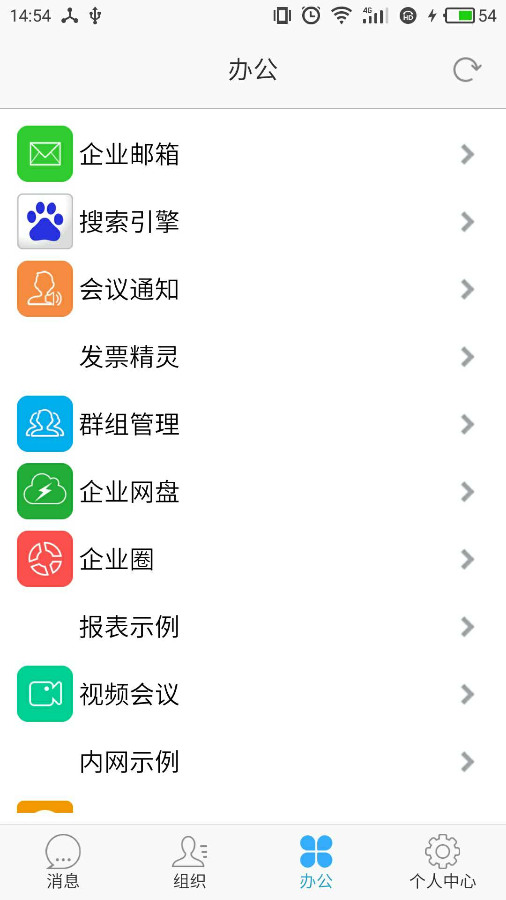
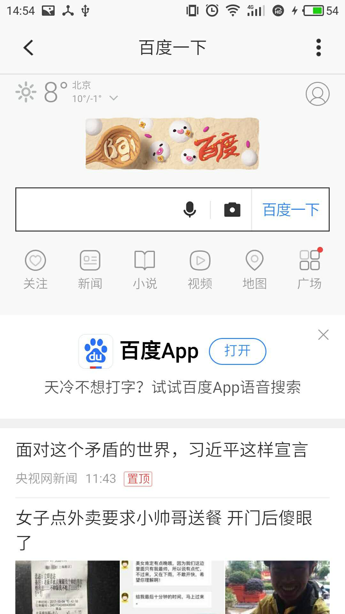

# 需求

为了保证信息安全，更好地管理企业的应用，客户希望开发一款移动门户应用，能够集中管理、启动应用，同时移动门户提供通用的即时通讯功能。

你将负责实现以下功能：

- 按照效果图实现移动门户的用户界面
- 从指定服务器端获取应用列表，并以瀑布流方式显示
- 使用内嵌的webview打开type=web的应用url
- 从移动门户应用打开应用列表中的原生应用。对于iOS，应用的type=ios，对于android，应用的type=android。

# 具体要求

使用你擅长的语言、框架实现以上需求。

## 用户界面

应用列表



webview打开网页



## 服务器端API

运行服务器端需要安装flask，`pip install flask`

进入克隆的项目根目录，执行以下命令启动server端

```shell
FLASK_APP=server.py flask run
```

API地址： http://localhost:5000/apps/{platform}

### 获取一页应用信息

请求参数：

|参数名|类型|默认值|说明|
|---|---|---|---|
|platform|string||当前运行平台，ios或android|
|page|int|0|要获取的页码，从0开始|
|size|int|10|一页所包含的记录数|

成功响应：

StatusCode: 200

|字段名|类型|默认值|说明|
|---|---|---|---|
|page|int|0|返回页的页码，从0开始|
|size|int|10|一页所包含的记录数|
|first|bool|true|是否第一页|
|last|bool|false|是否第一页|
|content|[app]||页面内容，类型是app|

app

|字段名|类型|默认值|说明|
|---|---|---|---|
|id|int||应用唯一标识|
|name|string||应用的名称|
|type|enum|web|应用类型，web/android/ios|
|package|string||应用的包名|
|version|string||应用的版本|
|icon|[{size,link}]||应用的不同尺寸的图标|
|url|string||web app的入口地址|
|scheme|string||原生应用的自定义scheme|

失败响应：

StatusCode: 4xx, 5xx

|字段名|类型|默认值|说明|
|---|---|---|---|
|message|string||错误描述信息|

示例：

请求android平台的第一页应用列表，最多包含四条记录。

```shell
curl http://localhost:5000/apps/android?page=0&size=4
```

```json
{
  "content": [
    {
      "icon": [
        {
          "link": "http://localhost:5000/images/1-48x48.png", 
          "size": "48x48"
        }, 
        {
          "link": "http://localhost:5000/images/1-128x128.png", 
          "size": "128x128"
        }
      ], 
      "id": 0, 
      "name": "百度", 
      "package": "", 
      "scheme": "", 
      "type": "web", 
      "url": "http://www.baidu.com", 
      "version": "v1.0.0"
    }, 
    {
      "icon": [
        {
          "link": "http://localhost:5000/images/2-48x48.png", 
          "size": "48x48"
        }, 
        {
          "link": "http://localhost:5000/images/2-128x128.png", 
          "size": "128x128"
        }
      ], 
      "id": 1, 
      "name": "微信", 
      "package": "com.tencent.mm", 
      "scheme": "x-venus-a-2", 
      "type": "android", 
      "url": "", 
      "version": "v1.0.0"
    }, 
    {
      "icon": [
        {
          "link": "http://localhost:5000/images/4-48x48.png", 
          "size": "48x48"
        }, 
        {
          "link": "http://localhost:5000/images/4-128x128.png", 
          "size": "128x128"
        }
      ], 
      "id": 2, 
      "name": "必应", 
      "package": "", 
      "scheme": "", 
      "type": "web", 
      "url": "https://cn.bing.com", 
      "version": "v1.0.0"
    }, 
    {
      "icon": [
        {
          "link": "http://localhost:5000/images/1-48x48.png", 
          "size": "48x48"
        }, 
        {
          "link": "http://localhost:5000/images/1-128x128.png", 
          "size": "128x128"
        }
      ], 
      "id": 3, 
      "name": "百度", 
      "package": "", 
      "scheme": "", 
      "type": "web", 
      "url": "http://www.baidu.com", 
      "version": "v1.0.0"
    }
  ], 
  "first": true, 
  "last": false, 
  "page": 0, 
  "size": 4
}
```

## 打开web应用

web类型的应用通过type=web来判断，该类型的应用信息里包含一个url属性，表示web应用的入口地址，移动门户使用webview打开该url即可。

## 打开原生应用

原生应用通过type=android/ios来判断，该类型的应用信息里包含scheme和package属性，可以用于启动原生应用。

需要提前在调试设备上安装用于测试的原生应用。